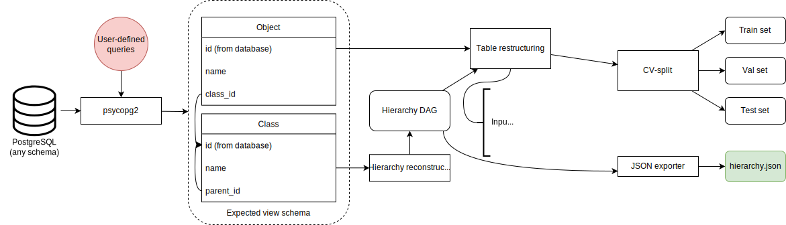

.. Adapters page.

Data adapters
===================================================

Our system uses what we call *data adapters* to process and convert input data from various sources and with different formats to one intermediate format that all models use for training.

Intermediate format specification
---------------------------------

An intermediate dataset is a dataset pre-processed to contain data in a specific format, with the necessary metadata packed along. It can be fed into any model in KTT without further processing, enabling future complex scenarios including out-of-core training support.

Intermediate datasets are already CV-split into three subsets (training, validation, and test). The ratio between these subsets is configurable by the user when using data adapters, but defaults to an 8:1:1 split. These subsets are mutually exclusive and do not contain overlapping rows. It is recommended to sample the original dataset randomly to fill these subsets instead of sectioning it, unless the original dataset is already shuffled.

Each subset is a single Apache Parquet partition, at least in the current iteration of KTT. Metadata is packed in a separate JSON file stored alongside these Parquet partitions.

A directory tree of an intermediate dataset is:

.. code-block:: bash

	datasets
	└── DatasetName
		├── hierarchy.json
		├── hierarchy.json.dvc
		├── test.parquet
		├── test.parquet.dvc
		├── train.parquet
		├── train.parquet.dvc
		├── val.parquet
		└── val.parquet.dvc
	
Each intermediate dataset resides in a folder titled with their name. This name is the one passed to training and export scripts. Within this folder are the aforementioned subsets, named ``train.parquet``, ``val.parquet`` and ``test.parquet`` for the training, validation and test subsets, respectively. The hierarchy file is ``hierarchy.json``. Additionally, each of these files have a ``.dvc`` placeholder, such that the actual files can be ignored by Git and instead pushed to a separate object-storage remote such as Google Drive or Amazon S3.

Parquet schema
~~~~~~~~~~~~~~

The column schema for Parquet partitions are very simple. They only consist of two columns:
- ``name``: The text strings representing each data object that will become the model's inputs after vectorisation.
- ``codes``: Lists of integers that denote, in root-to-leaf hierarchical order, which classes each data object belongs to. These integer codes are internal representations of discovered class labels.

For example, in an e-commerce use case, we can classify products into a hierarchy of categories based on their title. For a product titled 'Fresh organic McIntosh apples' belonging to ``Food & Produce->Fresh produce->Fruits``, whose internal codes are ``1, 10, 25, 70`` respectively, the cell for the ``name`` column would be said title, and the one for ``classes`` would be ``[1, 10, 25, 70]``. It is recommended to directly use Python lists instead of ``numpy ndarrays``. 

Hierarchy JSON schema
~~~~~~~~~~~~~~~~~~~~~

KTT uses various representations to integrate hierarchical structure knowledge into its models. All of these representations are stored in the JSON file titled ``hierarchy.json``.

The schema starts with a single root object. Within it are the following keys and their data:

- ``classes``: A list of class names. It contain classes from all hierarchical levels, organised by their level within the hierarchy (intra-level ordering is not specified, but is usually alphabetical). The order of this list determines the integer code given to each class.
- ``level_offsets``: A list of start and end indices for the levels. It contains one more element than there are levels, which is the last element, representing the end of the last level (which equates to ``len(classes)``). **For example**: ``level_offsets == [0,5,15,115]`` a 3-level hierarchy with 5, 10 and 100 classes in the first, second and third levels respectively. The first number is the first index of the first level, the second the first index of the second level (and also the first level's class count), the third the first index of the third level, and the fourth is the last index of the last level **plus one**. Remember, classes from all levels are concatenated together into the final ``classes`` list, hence the cumulative sum.
- ``level_sizes``: A list of integers representing sizes of each level. A level's size is simply the number of classes belonging to that level. For example, the example hierarchy above would have ``level_sizes == [5, 10, 100]``.
- ``parent_of``: A list of lists (or a jagged 2D array). Each sublist corresponds to one hierarchical level, such that index :math:`(i, j)` corresponds to the :math:`j^{th}` class of the :math:`i^{th}` hierarchical level (or ``level_offsets[i]+j`` in the global index space, following the above indexing scheme), and its value :math:`k` at that index corresponds to class :math:`(i, j)` 's parent, which is class :math:`k` in level :math:`i-1`. A special case is the first level, which, since we do not include the imaginary root node in the hierarchical representations, do not have any parent. For this level, simply use themselves as their own parents - that is, ``parent_of[0, i] = i``.
- ``M``: The M-matrix to be used with DistilBERT+Adapted C-HMCNN. It is essentially a :math:`|C|\times |C|` boolean matrix (where ``|C|==len(classes)`` is the number of classes in the entire hierarchy) recording the ancestry of each class. For each coordinate :math:`i,j \in [0, |C|]`, ``M[i,j]==1`` if there is a *directed* path from class :math:`j` to :math:`i` (that is, i is a descendant of j - the reverse does not count) and 0 otherwise. Note that :math:`M[i,i] == 1`` as each class is regarded as having a directed path to itself by C-HMCNN.
- ``R``: A variant of ``M``, recording ancestry for leaf classes only. Its size is therefore ``level_sizes[-1] x len(classes)``, where :math:`R[i,j] == 1` if there is a path from the from overall class :math:`j` to leaf class :math:`i`. The same rules as in M apply for R, just with applicable modifications to the coordinates to accommodate the fact that the first dimension now only contains leaf classes. Also similarly to M, :math:`R[i,i] == 1`.

A typical JSON (truncated) looks like this:

.. code-block:: javascript

	{
		"classes": ["Food", "Electronics", "Veggies", "Seafood", "Deli", "Laptops", "Smartphones"],
		"level_offsets": [0, 2, 7],
		"level_sizes": [2, 3],
		"parent_of": [[0,1],[0,0,0,1,1]],
		"M": [[1,0,0,...,0],[0,1,1,...,0],...,[0,1,0,0,0,0,1]],
		"R": [[1,0,1,0,0,0,0],...,[0,1,0,0,0,0,1]]
	}

Theory
-------------

A data adapter is responsible for fetching data from a source they are specialised at (for example, SQL for the SQL adapter, JSON/CSV/Parquet/Arrow for the flatfile adapter), possibly clean it, reorganise it, discover the hierarchy, encode classes into internal integer codes and convert the labels to said codes, CV-split and then write the processed subsets plus the hierarchical metadata into the aforementioned folder tree.

Currently, two adapters are provided:

The SQL adapter
~~~~~~~~~~~~~~~~~~~~~~~~

Design
^^^^^^

For CLI usage, see :ref:`adapter-sql`.

This adapter takes two queries from the user, one for each view as seen in the above diagram. It will use these two queries to fetch the above views as Pandas dataframes. These dataframes are then mined for hierarchical data. The rest is pretty standard, with the file exporting and folder organisation work being the same as described in the previous section.

The two queries are recommended to have some kind of limiting clause to restrict the size of the returned SQL views. The SQL adapter currently has to store everything in-memory for the processing algorithms.

Supported databases
^^^^^^^^^^^^^^^^^^^

The SQL adapter supports all SQL database management systems as supported by ``sqlalchemy``. It has been tested with PostgreSQL using the ``psycopg2`` driver.

The default instllation of KTT comes bundled with ``psycopg2`` and thus supports PostgreSQL out-of-the-box. To connect to other databases, you need to manually install drivers for them through either ``conda install`` or ``pip install``, and then configure the adapter correspondingly using the ``adapter_sql.json`` file. We recommend ``conda install`` if possible as Anaconda additionally takes care of non-Python executables and dependences as well as trying to install packages in the most compatible way possible (which is an entire optimisation problem). `This article <https://pythonspeed.com/articles/conda-vs-pip/>`_ is a good read on the matter.

A full list of supported dialects and their drivers is available at `SQLAlchemy's DBAPI support page <https://docs.sqlalchemy.org/en/14/dialects/>`_.

**Example:** to connect to a MariaDB database, you can pick one out of the many drivers available - here we choose `mysqlclient <https://docs.sqlalchemy.org/en/14/dialects/mysql.html#module-sqlalchemy.dialects.mysql.mysqldb>`_:

.. code-block:: bash
	
	 conda install -c conda-forge mysqlclient 

After installing ``mysqlclient``, change the dialect and driver in the configuration file to ``mysql`` and ``mysqlclient`` respectively:

.. code-block:: json

	{
		"dialect": "mysql",
		"driver": "mysqlclient",
		...
	}
	
Configuration schema
^^^^^^^^^^^^^^^^^^^^

- ``"dialect"``: The SQL dialect to use. ``sqlalchemy`` needs to support it.
- ``"driver"``: The driver to use with the above SQL dialect. ``sqlalchemy`` needs to support it.
- ``"host"``: Where the database server is, for example ``localhost``. Port number can be manually specified if your server runs on a non-default port.
- ``"database"``: Name of the database to read from.
- ``"user"`` and ``"password"``: Credentials to log into the database.
- ``"dataitem_query"``: How to query the database for data items (labeled objects to learn from). See :ref:`expected-schema` to know what the adapter expects. The default value shows an example of how to query from an e-commerce products database with product names in the ``title`` column and their leaf category IDs (labels) in the ``category_id`` column.
- ``"class_query"``: How to query the database for classes (labels). See :ref:`expected-schema` to know what the adapter expects. The default value shows an example of how to query from an e-commerce products database with product categories in a recursive relationship (thus forming a hierarchy) with ``id`` and ``parent_id`` being the ID of the category and its parent, respectively.

.. _expected-schema:

Expected view schema
^^^^^^^^^^^^^^^^^^^^

We expect two views, one for the data items and one for the classes.

The data item view needs to have two columns:

- ``name``: Textual name of the data object. This is the input to all the models.
- ``class_id``: The foreign key pointing to the primary key of the **leaf** class that this data object belongs to.

The class view needs to have two columns also:

- ``id``: The primary key of each class.
- ``parent_id``: The foreign key pointing to the primary key of the parent of each class. Use ``NULL`` if this is a top-level class (i.e. having no parent class).

The flatfile adapter
~~~~~~~~~~~~~~~~~~~~

For CLI usage, see :ref:`adapter-flat`.

This is a simpler adapter than SQL. In spite of its name, it actually takes in more than just flatfiles - anything that Pandas support.

For JSON, we also support specifying the tabular schemas to use. By default, ``records`` is preferred.
