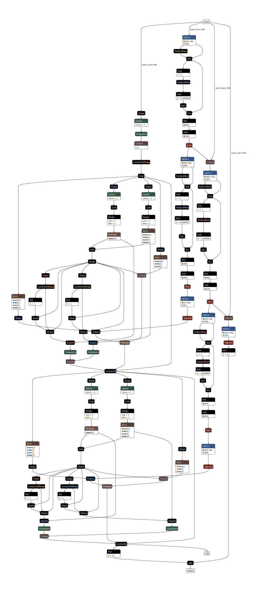

.. DistilBERT + Adapted HMCN-F documentation.

DistilBERT + Adapted HMCN-F
===========================

API
---

.. autoclass:: models.DB_AHMCN_F
   :members:
   :special-members:

Configuration schema
--------------------
The configuration for this model defines the following hyperparameters:

* ``classifier_lr``: Classifier (Adapted HMCN-F) learning rate.
* ``lambda_h``: Hierarchical loss gain.
* ``dropout``: The adapted HMCN-F model's dropout rate.
* ``global_hidden_sizes``: Hidden sizes for constructing the global layers (main flow).
* ``local_hidden_sizes``: Hidden sizes for constructing the local branches (local flow).
* ``global_weight``: Global weight to be forward-propagated.
* ``hidden_nonlinear``: Hidden nonlinear type which can be either ``relu`` or ``tanhh``.

Checkpoint schema
-----------------
* ``config``: A copy of the configuration dictionary passed to this instance's constructor, either explicitly, or by ``from_checkpoint`` (extracted from a prior checkpoint).
* ``hierarchy``: A serialised dictionary of hierarchical metadata created by ``PerLevelHierarchy.to_dict()``.
* ``classifier_state_dict``: Weights of the classifier (Adapted HMCN-F).
* ``optimizer_state_dict``: Saved state of the optimiser that was used to train the model for that checkpoint.

Theory
------

This replaces the simple linear layer found in the `DistilBERT + Linear <db_linear.html>`_ model with an adapted version of the HMCN-F model :cite:`wehrmann2018hierarchical`. HMCN-F is a fully-connected neural network with two flows, a global and a local one, designed to maximise the learning capabilities regarding the hierarchical nature of the data.
An example computation graph for the classifier is given below.

The global flow starts at the vectorised input and continues to a global prediction layer, which predicts classes for all levels at once, using information from the previous per-level global layers, each of which takes in a concatenation of the vectorised input and the previous layer's ReLU output, then outputs a hidden vector of the same arbitrarily-chosen size which will again become half of the next layer's input. The local flows take their inputs as residual outputs from the global flow's per-level layers through a per-level *transition* layer, then to a per-level *local classification* layer. These classification layers each predict the class at their level using information transformed from the corresponding global flow's level. The input of all local flow classification layers are then concatenated from left to right. For this reason, the global classification layer's output scores are also ordered by hierarchical level.

The final output of the model is then a weighted average of the global output and concatenated local outputs with ratio :math:`\beta`:

.. math::
    P_F = \beta P_G + (1-\beta)P_L

where :math:`P_L` is the concatenation of local outputs from the top to the bottom levels of the hierarchy DAG:

.. math::
    P_L = P_L^{1} ++ P_L^{2} ++ ... ++ P_L^{|H|}

where ++ signifies 1D vector concatenation along their main axis.
This ordering has a second benefit of allowing for very simple parsing: instead of having to train the model against a threshold that picks out the top :math:`|H|` categories (for :math:`|H|` levels) and achieve neither hierarchical compliance nor even the basic guarantee that each top-performing category belongs to a different level, we can simply slice the output vector into per-level segments, then pass each through an :math:`argmax` function to determine the predictions.

We employ three loss functions. The first is a global loss function used to train the global flow, the second is the sum of losses for each of the local classification layers' outputs, and the third is used on the final output :math:`P_F` to directly train the model against hierarchical constraints. For the third loss function, we define a hierarchical violation as when the predicted score of a node is larger than its parent node's score. All three loss functions revolve around the averaged *binary cross-entropy loss* (BCE) formula:

.. math::
    \epsilon(y, f(x)) = mean_{n=1}^{|N|}(-w_n[y_n \log(f(x)_n) + (1-y_n)\log(1-f(x)_n)])

where :math:`mean_{n=1}^{|N|}()` averages over the N examples in :math:`f(x)`, in case minibatch training is implemented.
With this base BCE loss, we construct the aforementioned three loss functions, the global, local and hierarchical loss respectively:

.. math::
    L_G(y, f(x)) = \epsilon(y, f(x))

.. math::
    L_L(y, f(x)) = \sum_{h=1}^{|H|}[\epsilon(y_L^h, f(x)_L^h)]

.. math::
    L_H(y) = \sum_{n=1}^{|N|}(\max(0, y - parent(y))^2)

We have implemented :math:`parent()` as a lookup vector where each element contains the index of the parent node of the one at that element's index. As we do not encode the root node, nodes immediately below it have their parents set to themselves, in effect zeroing out the formula which is in line with the expected behaviour (as technically they do not have to obey any hierarchical constraint at all). PyTorch's slicing capabilities retains the order of indexing and make this possible without using un-accelerated loops, ensuring little to no overhead. The final loss function is then the sum of the three above functions:

.. math::
    L = L_G + L_L + \lambda L_H

where :math:`\lambda` is the hierarchical loss scale factor. 
