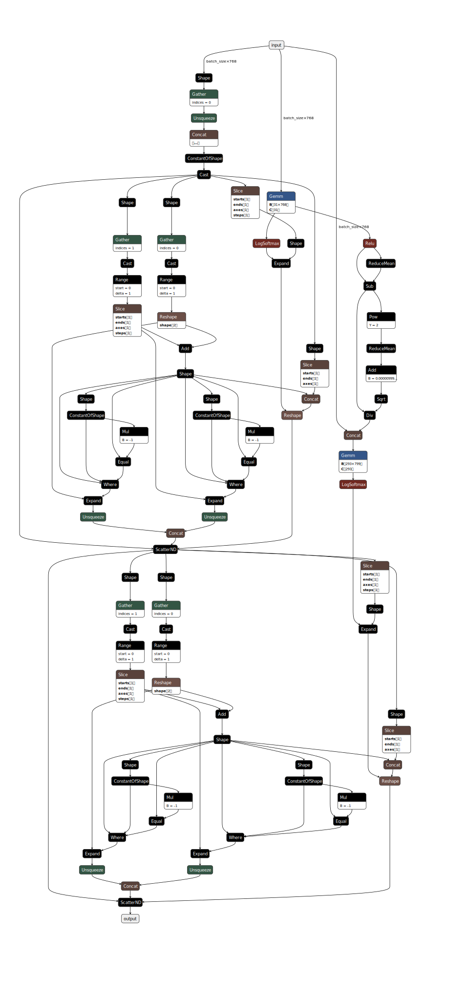

.. DB-BHCN and DB-BHCN+AWX documentation.

DB-BHCN
=======

API
---

.. autoclass:: models.DB_BHCN
   :members:
   :special-members:

Configuration schema
--------------------

The configuration for this model defines the following hyperparameters:

* ``encoder_lr``: Encoder (DistilBERT) learning rate.
* ``classifier_lr``: Classifier learning rate.
* ``dropout``: The model's dropout rate.
* ``hidden_nonlinear``: The FCFF model's nonlinear type, which can be either ``relu`` or ``tanhh``.
* ``lambda_l``: intensity of the local loss function.
* ``gamma_l``: the gamma value of the loss function (how skewed are bottom levels' penalisation compared to upper levels).
* ``lambda_h``: intensity of the hierarchical loss function.

Default tuning configuration
----------------------------

.. code-block:: json

    "db_bhcn": {
        "display_name": "DB-BHCN",
        "train_minibatch_size": 16,
        "val_test_minibatch_size": 64,
        "max_len": 64,
        "range": {
            "encoder_lr": [0.00002, 0.00009],
            "classifier_lr": [0.0002, 0.0009],
            "gamma_l": [-0.2, 0.2],
            "lambda_l": 1.0,
            "lambda_h": [0.2, 0.9],
            "dropout": [0.1, 0.5],
            "hidden_nonlinear": "relu"
        },
        "mode": {
            "encoder_lr": "uniform",
            "classifier_lr": "uniform",
            "gamma_l": "uniform",
            "lambda_l": "fixed",
            "lambda_h": "uniform",
            "dropout": "uniform",
            "hidden_nonlinear": "fixed"
        }
    },

Checkpoint schema
-----------------

* ``config``: A copy of the configuration dictionary passed to this instance's constructor, either explicitly, or by ``from_checkpoint`` (extracted from a prior checkpoint).
* ``hierarchy``: A serialised dictionary of hierarchical metadata created by ``PerLevelHierarchy.to_dict()``.
* ``encoder_state_dict``: Weights of the DistilBERT model.
* ``classifier_state_dict``: Weights of the classifier.
* ``optimizer_state_dict``: Saved state of the optimiser that was used to train the model for that checkpoint.

Theory 
------
DB-BHCN
~~~~~~~~~~~~~~~~~~~~~~~~~
DB-BHCN stands for the the DistilBERT Branching Hierarchical Classification Network (DB-BHCN) model, which is designed specifically to maximise the utilisation of advanced language comprehension capabilities made available by DistilBERT model.

An example computation graph for the classifier is given below.

The topology's depth matches that of the hierarchy with no additional layer, while its output size at each layer corresponds to the number of classes at the corresponding hierarchical level. Outputs are taken in a residual manner from each layer, 'branching' from the main flow, hence the name. Between layers, the hidden output first goes through a hidden nonlinear function, then a layer normalisation function, then a dropout stage whose probability is a hyperparameter.

Formally, let :math:`x \in \mathbb{R}^{768 \times 1}` be the feature vector, that is, the direct input that came from the fine-tuned DistilBERT instance that goes into the fully-connected flow; :math:`H` be the depth-padded hierarchy object for which :math:`|H|` represents its depth, :math:`C_H` be the set of classes in H where :math:`C_{H_h}` represents the set of classes at level :math:`h`; :math:`W` and :math:`b` be the set of weights and biases where :math:`W_h \in \mathbb{R}^{|C_{H_h}| \times |A^{h-1}|}` and :math:`b_h \in \mathbb{R}^{|A^{h-1}| \times 1}` are the weights and biases of layer :math:`h`, respectively; :math:`z^h \in \mathbb{R}^{|C_{H_h}| \times 1}` represents the linear output from layer :math:`h`, :math:`A^h = \phi(z^h)` being the hidden nonlinear output with :math:`\phi` being a hidden nonlinear activation function (such as ReLU or tanh); and :math:`P^h = \psi(z^h)` being the output scores for classes of level :math:`h` in hierarchy :math:`H`, with :math:`\psi` being the output nonlinear activation function, which in this case is the typical LogSoftmax function.

DB-BHCN's data flow is relatively straightforward. The input text is first encoded by a fine-tuned DistilBERT instance into :math:`x`. This enters the first fully-connected level, which produces :math:`z_1`, which is then transformed by :math:`\phi` and :math:`\psi` into :math:`A_1` and :math:`P_1`, respectively:

.. math::
      z^1 = W^1x + b^1 
.. math::
      A^1 = \phi(z^1) 
.. math::
      P^1 = \psi(z^1) 

Then, for each non-leaf layer :math:`0 < h \neq |H|`, the same happens, with a small difference from the input layer in that the previous output is also concatenated with the original feature vector:

.. math::
   z^h = W^h(x ++ A^{h - 1}) + b^{h} 
.. math::
   A^h = \phi(z^h) 
.. math::
   P^h = \psi(z^h) 

where, :math:`W^h \in \mathbb{R}^{|C_{H_h}| \times (|x| + |A^{h - 1}|)}`. The last layer (where :math:`h = |H|`) does not produce `A^{|H|}` as there is no further layer after it. Layer normalisation and dropout are performed in said order but not shown here for clarity. For indexing classes, each hierarchical level's label indexing starts from zero, and the hierarchical label is then represented as an ordered list of indices. The complete classification for each example is the concatenation of one-hot vectors from each level.
