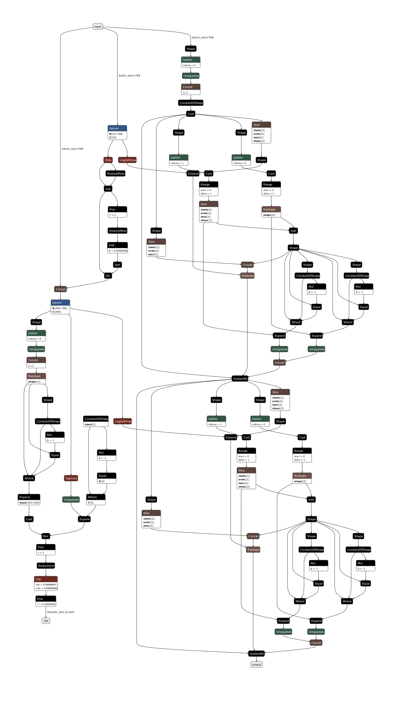

DB-BHCN+AWX
===========

API
---

.. autoclass:: models.DB_BHCN_AWX
   :members:
   :special-members:

Configuration schema
--------------------

The configuration for this model defines the following hyperparameters:

* ``encoder_lr``: Encoder (DistilBERT) learning rate.
* ``classifier_lr``: Classifier learning rate.
* ``dropout``: The model's dropout rate.
* ``hidden_nonlinear``: The FCFF model's nonlinear type, which can be either ``relu`` or ``tanhh``.
* ``lambda_l``: intensity of the local loss function.
* ``gamma_l``: the gamma value of the loss function (how skewed are bottom levels' penalisation compared to upper levels).
* ``awx_norm``: represents the max that the matrix awx stretches (default 5) (Adjacency Wrapping Matrix layer option).

Default tuning configuration
----------------------------

.. code-block:: json

    "db_bhcn_awx": {
        "display_name": "DB-BHCN+AWX",
        "train_minibatch_size": 16,
        "val_test_minibatch_size": 64,
        "max_len": 64,
        "range": {
            "encoder_lr": [0.00002, 0.00009],
            "classifier_lr": [0.0002, 0.0009],
            "gamma_l": [-0.7, 0.7],
            "lambda_l": [0.2, 0.8],
            "dropout": [0.1, 0.6],
            "awx_norm": 5,
            "hidden_nonlinear": "relu"
        },
        "mode": {
            "encoder_lr": "uniform",
            "classifier_lr": "uniform",
            "gamma_l": "uniform",
            "lambda_l": "uniform",
            "dropout": "uniform",
            "awx_norm": "fixed",
            "hidden_nonlinear": "fixed"
        }
    },

Checkpoint schema
-----------------

* ``config``: A copy of the configuration dictionary passed to this instance's constructor, either explicitly, or by ``from_checkpoint`` (extracted from a prior checkpoint).
* ``hierarchy``: A serialised dictionary of hierarchical metadata created by ``PerLevelHierarchy.to_dict()``.
* ``encoder_state_dict``: Weights of the DistilBERT model.
* ``classifier_state_dict``: Weights of the classifier.
* ``optimizer_state_dict``: Saved state of the optimiser that was used to train the model for that checkpoint.

Theory
------
One large weakness of DB-BHCN is that it only strives to be as close to be hierarchically-compliant as possible, but cannot guarantee to be always so. As its name implies, this variant is a modified instance of our model that is then coupled with our implementation of the Adjacency Wrapping Matrix (AWX) layer from :cite:`masera2018awx`. In this variant, the local outputs branching from the flow are relegated to loss function minimisation duty. 

DB-BHCN requires small changes to be able to integrate with AWX, the most significant of which being the omission of the hierarchical loss function. As AWX already uses :math:`R`, it needs not learn hierarchical constraints through backward propagation. In addition, we have empirically found that the hierarchical loss conflicts with the AWX layer. In its place, we compute a binary cross-entropy (BCE) loss value from the AWX output and use it in conjunction with the existing local loss function. The local loss function on the other hand was found to contribute significantly to this variant's capability to quickly pick up performance early in training. Another adaptation is the usage of the Sigmoid activation function before feeding the last hidden layer to AWX. LogSoftmax activation is still used for the concatenated local outputs for use with the existing NLL-based local loss function.

An example computation graph for the classifier is given below.

