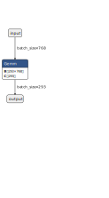

.. DistilBERT + Linear documentation.

DistilBERT + Linear
===================

API
---

.. autoclass:: models.DB_Linear
   :members:
   :special-members:

Configuration schema
--------------------
The configuration for this model defines the following hyperparameters:

* ``encoder_lr``: Encoder (DistilBERT) learning rate.
* ``classifier_lr``: Classifier learning rate.
* ``dropout``: The model's dropout rate.

Checkpoint schema
-----------------
* ``config``: A copy of the configuration dictionary passed to this instance's constructor, either explicitly, or by ``from_checkpoint`` (extracted from a prior checkpoint).
* ``hierarchy``: A serialised dictionary of hierarchical metadata created by ``PerLevelHierarchy.to_dict()``.
* ``encoder_state_dict``: Weights of the DistilBERT model.
* ``classifier_state_dict``: Weights of the classifier.
* ``optimizer_state_dict``: Saved state of the optimiser that was used to train the model for that checkpoint.

Theory 
------
This is our deep-learning equivalent to Tfidf_LSGD, in which the vectorisation is done by DistilBERT and the leaf-level classification by a single linear layer. An example computation graph for the classifier is given below.

As there is only one linear layer after BERT and as our parsing scheme is a simple :math:`argmax`` to determine the highest-scoring leaf class, we do not use any nonlinearity in the forward pass after the classifier and keep the scores as-is. On the backward pass, however, we pass the raw output through a LogSoftmax function.

.. math::
    LogSoftmax(y_i)=\log(\frac{\exp(x_i)}{\sum_j\exp(x_j)})

before handing it over to our averaged negative log-likelihood loss function

.. math::
    L(y, f(x)) = \sum_{n=1}^N(\frac{1}{\sum_{n=1}^N(w_{y_n})} \times l_n(y, f(x))

where :math:`x` is the batch input of size :math:`N \times C` (i.e. :math:`x` can contain more than one example, in which case it is a minibatch); :math:`y` of size :math:`N \times 1` is the corresponding target class indices for examples in :math:`x`; :math:`w_{y_n}` represents the weight of the correct class (which is the target :math:`y`) of example :math:`n` within :math:`x`; :math:`l_n` is defined as:

.. math::
    l_n(y, f(x)) = -w_{y_n} \times f(x)_{n, y_n}

where :math:`f(x)_{n, y_n}` represents the score for the correct class of example :math:`n` within the output of our model :math:`f` for input :math:`x`.
