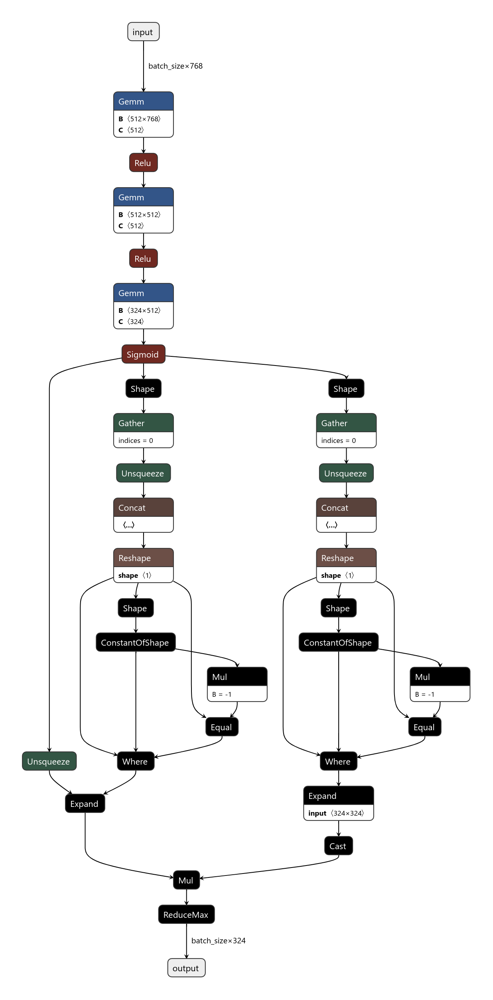

.. DistilBERT + Adapted C-HMCNN documentation.

DistilBERT + Adapted C-HMCNN
============================

API
---

.. autoclass:: models.db_achmcnn.DB_AC_HMCNN
   :members:
   :special-members:

Configuration schema
--------------------
The configuration for this model defines the following hyperparameters:

* ``encoder_lr``: Encoder (DistilBERT) learning rate.
* ``classifier_lr``: Classifier (Adapted C-HMCNN) learning rate.
* ``h_dropout``: The fully-connected feed-forward (FCFF) model's dropout rate.
* ``h_nonlinear``: The FCFF model's nonlinear type, which can be either ``relu`` or ``tanhh``.
* ``h_hidden_dim``: The hidden layer size in the FCFF.
* ``h_layer_count``: Number of feedforward layers in the FCFF. Minimum is 1. If 1 is specified, a Linear layer with size (768, `class_count`) will be created and ``h_hidden_dim`` is not used.

Checkpoint schema
-----------------
* ``config``: A copy of the configuration dictionary passed to this instance's constructor, either explicitly, or by ``from_checkpoint`` (extracted from a prior checkpoint).
* ``hierarchy``: A serialised dictionary of hierarchical metadata created by ``PerLevelHierarchy.to_dict()``.
* ``encoder_state_dict``: Weights of the DistilBERT model.
* ``classifier_state_dict``: Weights of the classifier (Adapted C-HMCNN).
* ``optimizer_state_dict``: Saved state of the optimiser that was used to train the model for that checkpoint.

Theory
------

This is an adaptation of the Coherent Hierarchical Multilabel Classification Neural Network, or C-HMCNN for brevity, initially published in :cite:`giunchiglia2020`, to an NLP and BERT-friendly design. It takes in fine-tuned DistilBERT encodings and produces hierarchical classifications.
An example computation graph for the classifier is given below.

C-HMCNN is a combination of a standard fully-connected feed-forward (FCFF) neural network (one that would be used for traditional multilabel classification tasks), a special post-processing algorithm that enforces hierarchical compliance and a special loss function to correctly guide training with such post-processing applied.

The default configuration of the FCFF network follows the recommended hyperparameters in the titular paper, with three linear layers using ReLU activation functions and the output layer using a sigmoid activation function. It is then followed by a special post-processor, termed *max constraint module* or MCM for short. To describe the workings of MCM, let A and B be two classes in a hierarchy such that A is a child of B, :math:`h` be the FCFF network with :math:`h_A` and :math:`h_B` be the outputs of :math:`h` for classes A and B, respectively, and let :math:`y_A` and :math:`y_B` be their ground truths (0 or 1). MCM can then be expressed as:

.. math::
    \text{MCM}_A & = h_A

   \text{MCM}_B & = \max(h_B, h_A)

With this, MCM ensures that when the model predicts an example to be in class A, it must also predict that the example belongs to the parent of A, and then to the grandparent of A, and so on, effectively enforcing a hierarchically-compliant chain of classes back to the root, given any threshold. Our implementation of MCM involves generating a two-dimensional *ancestry matrix* :math:`M \in \mathbb{R}^{|C| \times |C|}` in which :math:`M_{ij} = 1` if class :math:`i` (in the indexing scheme) is a direct parent of class :math:`j` or if :math:`i=j` and 0 otherwise. In effect, row :math:`i` would then represent the set of subclasses of class :math:`i`, including class :math:`i` itself. Then, a *filtered* intermediate representation :math:`H \in \mathbb{R}^{|C| \times |C|}` of the output is computed as a Hadamard product between a :math:`C`-stacked version of the output (in other words, :math:`|C|` rows of :math:`h \in R^{|C| \times 1}`) with :math:`M`. Every row :math:`i` of this intermediate output effectively contains only the scores of classes within the set of subclasses of class :math:`i` (again, including itself), with all other scores zeroed out. :math:`\text{MCM}_B` is then simply :math:`\text{argmax}(H, dim=1)`.

This post-processing necessitates a special loss function which the paper termed *max constraint loss*, or MCLoss:

.. math::
   \text{MCLoss}_A(y, f(x)) & = -y_A\ln(f(x))-(1-y_A)\ln(1-f(x))

   \text{MCLoss}_B(y, h, f(x)) & = -y_B\ln(\max(h_B, h_A y_A)) - (1-y_B)\ln(1-f(x))

   \text{MCLoss}(y, h, \text{MCM}) & = \text{MCLoss}_A(y, \text{MCM}_A) + \text{MCLoss}_B(y, h, \text{MCM}_B)

A proof of the necessity for this novel loss function, which itself is derived from the typical BCE loss that we are familiar with, can be found in the titular paper.

.. bibliography::
